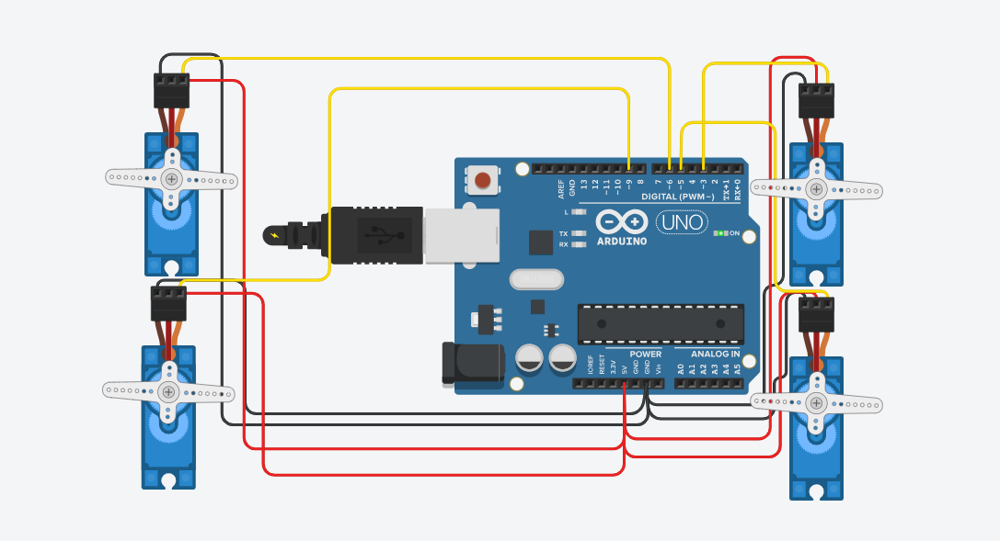

# 4 Servos - Sweep then Hold

Arduino code that controls 4 servo motors using TinkerCAD simulation.

## Task
- Run all 4 servos using the Sweep pattern (0° → 180° → 0°) for 2 seconds.
- After 2 seconds, all motors hold at 90°.

## Circuit
- Arduino Uno R3
- 4x Servo Motors
- Connections:
  - Servo 1 → Pin 3
  - Servo 2 → Pin 5
  - Servo 3 → Pin 6
  - Servo 4 → Pin 9
  - All Red wires → 5V
  - All Black wires → GND

## Demo Video
See Circuitdesign.mp4 in the repository files above.

## Program
TinkerCAD (Arduino IDE - Text mode)

## Files
- `four_servos_sweep_hold.ino` - Arduino source code
- `circuit-image.png` - Circuit design screenshot
- `Circuitdesign.mp4` - Simulation demo video
